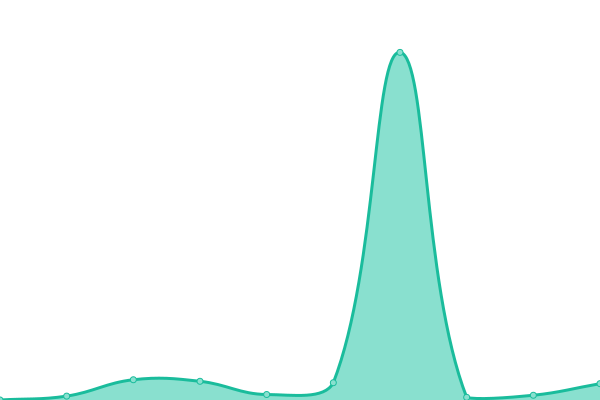

# [📈 Live Status](https://ryspc.github.io/uptime): <!--live status--> **🟩 All systems operational**

This repository contains the open-source uptime monitor and status page for [Ray Space](rayspace.co), powered by [Upptime](https://github.com/upptime/upptime).

With [Upptime](https://upptime.js.org), you can get your own unlimited and free uptime monitor and status page, powered entirely by a GitHub repository. We use [Issues](https://github.com/ryspc/uptime/issues) as incident reports, [Actions](https://github.com/ryspc/uptime/actions) as uptime monitors, and [Pages](https://ryspc.github.io/uptime) for the status page.

<!--start: status pages-->
<!-- This summary is generated by Upptime (https://github.com/upptime/upptime) -->
<!-- Do not edit this manually, your changes will be overwritten -->
<!-- prettier-ignore -->
| URL | Status | History | Response Time | Uptime |
| --- | ------ | ------- | ------------- | ------ |
|  [shredius.com](https://shredius.com) | 🟩 Up | [shredius-com.yml](https://github.com/ryspc/uptime/commits/HEAD/history/shredius-com.yml) | 

 4054ms
     
 | 

<a href="https://ryspc.github.io/uptime/history/shredius-com">98.77%</a>
    

|  [rayspace.co](https://rayspace.co) | 🟩 Up | [rayspace-co.yml](https://github.com/ryspc/uptime/commits/HEAD/history/rayspace-co.yml) | 

 2323ms
     
 | 

<a href="https://ryspc.github.io/uptime/history/rayspace-co">98.78%</a>
    

|  [suizadiamonds.com](https://www.suizadiamonds.com) | 🟩 Up | [suizadiamonds-com.yml](https://github.com/ryspc/uptime/commits/HEAD/history/suizadiamonds-com.yml) | 

 907ms
     
 | 

<a href="https://ryspc.github.io/uptime/history/suizadiamonds-com">98.78%</a>
    

<!--end: status pages-->

[**Visit our status website →**](https://ryspc.github.io/uptime)

## 📄 License

- Powered by: [Upptime](https://github.com/upptime/upptime)
- Code: [MIT](./LICENSE) © [Ray Space](rayspace.co)
- Data in the `./history` directory: [Open Database License](https://opendatacommons.org/licenses/odbl/1-0/)
